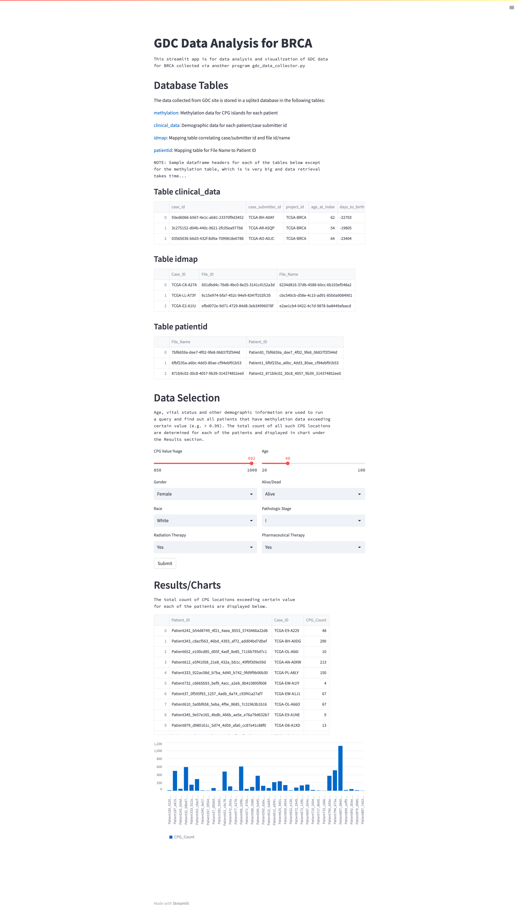

# GDC Data Analyzer for BRCA

This app is for analyzing Breast Cancer data collected from NIH National Cancer Institute GDC Data Portal - https://portal.gdc.cancer.gov/.

## Data Collection
Currently, data collection task is outside the scope of this app and has to be separately downloaded. Data from GDC site can be downloaded as a zipped file. However, a better/reliable way to collect the data folders/files is to download the manifest file and use the gdc-client bulk transfer tool. e.g.
`$ gdc-client download -m gdc_manifest_20230214_054927.txt`

## Data Processing
Once all the data folders/files are downloaded/unzipped/untarred, gdc_data_collector.py program can be run to recursively search each folder/file and collect methylation data and store them in sqlite3 database.
`$ python3 gdc_data_collector.py --build`

**NOTE:** All methylation data folders, gdc_sample_sheet CSV file and clinical_data CSV files must be in the same directory for the gdc_data_collector.py program to run.

## Data Analysis/Visualization
Once the database is built using gdc_data_collector.py the Streamlit app app.py can be run for data analysis/visualization.
`$ streamlit run app.py`

On the web UI, select various input parameters in the Data Selection section and hit the Submit button. The program will print -- for all the patients matching the selection criteria (such as age, gender, vital status etc. -- the count of CPG data exceeding certain value, e.g. > 0.99. The output is shown as a table as well as a bar chart.

Thus, the app helps analyze the GDC data by focusing on various factors and the impact of the disease based on those criteria.

Here is a screenshot of the Streamlit app.
